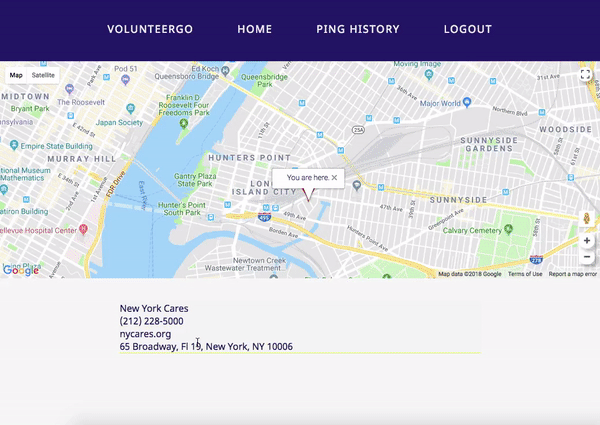

# VolunteerGo
*Here to lend a helping hand.*

Hello, and welcome to VolunteerGo, a responsive web application that I built as a passion project.


--- 

## Background

I initially thought of this app during the [Access Code](https://www.c4q.nyc/accesscode/) application process. The idea came about as a solution to a problem I had back in college. As part of the Honors program, I needed to meet a minimum number of service hour requirements. Between going to school as a full-time student and working almost full-time hours in retail, it was difficult to squeeze in these hours.

It would have been great if I had an app, like VolunteerGo, where I could find non-profit organizations around me and send them a quick message to see if they needed me that day. I would have loved to volunteer in the 2-hour scheduled breaks during certain school days, but there weren't any technologies available back then that did something like this.

Thus, the idea for this app was born.

In my design of the app, I wanted it to be simple to use, with minimal effort required for both parties involved. The responsiveness of the app (who doesn't have a cell phone these days?), easy to understand buttons, and simplistic and clean layout make the app incredibly user-friendly.

---

## Features

  
  
  * Sign up for an account, either as a volunteer or a non-profit organization
  * Users are authenticated using passport.js, and passwords are salted, hashed, and stored securely in the database

### __As an organization__:

  
  
  - Start receiving pings (volunteers send this to alert you of their availability) right away
  - Accept or decline pings based on your organizational needs
  - See your ping history (separated by accepted, declined, and pending)
  
### __As a volunteer__:

  
  
  - View your current location
  - See location and information of nearby non-profits
  - Send pings to these non-profits
  - See your ping history (separated by accepted, declined, and pending)

---

## Installation

In terminal:

1. Clone this repo 
```
$ git clone [repo]
```
2. cd into repo root directory and install all dependencies for the backend
```
$ cd [/path/to/repo/]
$ npm install
```
3. cd into frontend directory and install all dependencies
```
$ cd frontend
$ npm install
```
4. Seed database
  - [PostgreSQL](https://www.postgresql.org/) was used as the database, with [PSequel](http://www.psequel.com/) as the GUI
  - From the root directory
  ```
  $ cd db
  $ psql -f volunteergo.sql
  ```
  - This should populate the server with dummy data
5. Grab a Google API key [here](https://developers.google.com/maps/documentation/javascript/get-api-key)
6. Create a process.env file in your root directory to hold your environment variables
```
$ cd ..
$ touch .env
```
7. Open your .env file in an IDE
  - Declare two environment variables, `GOOGLE_KEY` and `DATABASE_URL`
  ```
  GOOGLE_KEY = [google_API_key_here]
  DATABASE_URL = [database_url_here]
  ```

7. Run the project
  - You'll need to open two separate terminal tabs/windows, 
  - First tab/window: root directory
    ```
    $ npm start
    ```
  - Second tab/window: frontend folder
    ```
    cd frontend
    npm start
    ```
---

## How VolunteerGo Was Built

With love and care, naturally! But I also used Express, Node.js, and PostgreSQL on the back-end, and React.js and HTML/CSS on the front-end. The following APIs / packages were used:

* [Google Maps API](https://developers.google.com/maps/documentation/javascript/tutorial)
  * [Geocoding](https://developers.google.com/maps/documentation/javascript/geocoding)
  * [Markers](https://developers.google.com/maps/documentation/javascript/markers)
  * [Info Windows](https://developers.google.com/maps/documentation/javascript/infowindows)
* [google-maps-react](https://www.npmjs.com/package/google-maps-react)
* [react-modal](https://www.npmjs.com/package/react-modal)
* [react-tabs](https://www.npmjs.com/package/react-tabs)

---

## __Next Steps__: The Future of VolunteerGo

- Implement notifications for both user groups on ping status changes
- More dynamic map experience for volunteers
- Implement confirmations for sending/declining requests
- Email confirmation to reduce fake account creation
- User profiles for both user groups
- AWS to host user images (for profile pictures)
